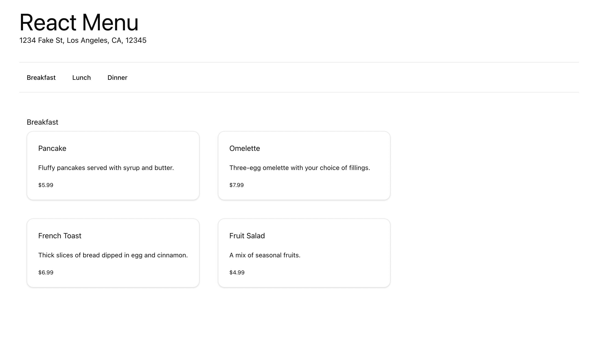

# React Menu Application

A reference React application implementing SPA with CI/CD pipeline.



## Getting Started

This version of application is based on React 19.

### Prerequisites

- Clone the repository: https://github.com/richiexuetang/react-menu
- [Install Dependencies w/ PNPM](https://pnpm.io/)

### Running the application

> [!WARNING]
> Node version 18+

- Or run the application from your terminal:

```sh
pnpm i
pnpm dev
```

### Azure Open AI

When using Azure OpenAI, inside _eShop.AppHost/appsettings.json_, add the following section:

```json
  "ConnectionStrings": {
    "OpenAi": "Endpoint=xxx;Key=xxx;"
  }
```

Replace the values with your own. Then, in the eShop.AppHost _Program.cs_, set this value to **true**

```csharp
bool useOpenAI = false;
```

Here's additional guidance on the [.NET Aspire OpenAI component](https://learn.microsoft.com/dotnet/aspire/azureai/azureai-openai-component?tabs=dotnet-cli).

### Use Azure Developer CLI

You can use the [Azure Developer CLI](https://aka.ms/azd) to run this project on Azure with only a few commands. Follow the next instructions:

- Install the latest or update to the latest [Azure Developer CLI (azd)](https://aka.ms/azure-dev/install).
- Log in `azd` (if you haven't done it before) to your Azure account:

```sh
azd auth login
```

- Initialize `azd` from the root of the repo.

```sh
azd init
```

- During init:

  - Select `Use code in the current directory`. Azd will automatically detect the .NET Aspire project.
  - Confirm `.NET (Aspire)` and continue.
  - Select which services to expose to the Internet (exposing `webapp` is enough to test the sample).
  - Finalize the initialization by giving a name to your environment.

- Create Azure resources and deploy the sample by running:

```sh
azd up
```

Notes:

- The operation takes a few minutes the first time it is ever run for an environment.
- At the end of the process, `azd` will display the `url` for the webapp. Follow that link to test the sample.
- You can run `azd up` after saving changes to the sample to re-deploy and update the sample.
- Report any issues to [azure-dev](https://github.com/Azure/azure-dev/issues) repo.
- [FAQ and troubleshoot](https://learn.microsoft.com/azure/developer/azure-developer-cli/troubleshoot?tabs=Browser) for azd.

## Contributing

For more information on contributing to this repo, read [the contribution documentation](./CONTRIBUTING.md) and [the Code of Conduct](CODE-OF-CONDUCT.md).

### Sample data

The sample catalog data is defined in [catalog.json](https://github.com/dotnet/eShop/blob/main/src/Catalog.API/Setup/catalog.json). Those product names, descriptions, and brand names are fictional and were generated using [GPT-35-Turbo](https://learn.microsoft.com/en-us/azure/ai-services/openai/how-to/chatgpt), and the corresponding [product images](https://github.com/dotnet/eShop/tree/main/src/Catalog.API/Pics) were generated using [DALL·E 3](https://openai.com/dall-e-3).

## eShop on Azure

For a version of this app configured for deployment on Azure, please view [the eShop on Azure](https://github.com/Azure-Samples/eShopOnAzure) repo.
